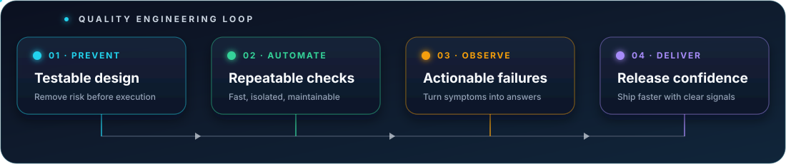

  

  

  

    
    
    
  

  <h3>Reliable automation · Actionable diagnostics · Faster delivery</h3>

  

    I design maintainable test systems and build Python tooling at the point where 
    <strong>quality assurance, software engineering, and observability</strong> meet.
  

 

## ⚡ Engineering quality into every release

I’m a QA Automation Engineer and Python developer who treats quality as an engineering system — not a final checkpoint.

I’m most useful where product risk becomes a technical problem: designing testable flows, automating high-value scenarios, and making failures explain themselves. I don’t only test software — I build the tooling around quality.

| 🧪 Test automation | 🐍 Python tooling | 🔍 Failure intelligence | 🚀 Delivery pipelines |
| --- | --- | --- | --- |
| Scalable Playwright + pytest architecture | Reusable CLI and web-based tools | Screenshots, logs, filters, and root-cause signals | Deterministic Docker and CI environments |
| Page Object, API setup, isolated test data | FastAPI, parsers, storage, integrations | Useful evidence instead of pass/fail-only output | Automated checks close to every change |

  

## 🚀 Featured engineering work

  
  

### 🧪 [Playwright + pytest E2E Framework](https://github.com/DanGiun/web-testing-framework)

A production-like cross-browser E2E framework for a React, Node.js, and PostgreSQL application — built to keep tests readable, independent, and useful when something breaks.

- Page Object layer, centralized selectors, and reusable UI primitives
- API-assisted setup, unique users, and safe teardown for isolated scenarios
- Chromium, Firefox, WebKit, and Edge execution through pytest CLI options
- Full-page screenshots and downloadable CI diagnostics on failure
- GitHub Actions pipeline that provisions PostgreSQL, builds the application, and runs the E2E suite
- Coverage of authentication, card CRUD, folders, and learning-session workflows

  
  
  
  
  

**Engineering signal:** the repository demonstrates not just test scripts, but the full feedback loop — environment provisioning, data lifecycle, cross-browser execution, and failure artifacts.

---

### 🔍 [Log Viewer — Real-time Observability Tool](https://github.com/DanGiun/log-monitor)

A local-first Linux application for monitoring and analyzing multiple logs in real time — designed to shorten incident investigation and test-failure analysis without modifying source logs.

- Local files and remote SSH/SFTP sources with isolated retryable readers
- FastAPI REST + WebSocket backend and responsive browser UI
- Text, JSON Lines, multiline, syslog, and custom timestamp parsing
- `AND` / `OR` / `NOT`, grep, regex, severity, source, JSON, and time filters
- Ephemeral SQLite/WAL buffer with bounded storage and stable event ordering
- Security-first defaults: localhost binding, strict SSH host keys, private runtime files, read-only sources

  
  
  
  
  

**Engineering signal:** 94 automated tests pass with 84% statement/branch coverage, including parsing, filtering, storage, rotation, SSH policy, API, WebSocket, and lifecycle risks.

## 🧰 Technology toolkit

  

    

  
  
  
  
  
  

## 🧭 Quality principles

| I optimize for | Not for |
| --- | --- |
| Maintainable automation | Fragile scripts that only their author understands |
| Actionable diagnostics | Reports that stop at “failed” |
| Risk-based coverage | Test-case quantity as a vanity metric |
| Simple, extensible architecture | Complexity without a clear payoff |
| QA + development collaboration | Quality ownership isolated in one role |

> My goal is not only to find defects. It is to build systems that prevent them — and make the remaining failures fast to understand.

## 🐍 Consistency, visualized

  <picture>
    <source media="(prefers-color-scheme: dark)" srcset="https://raw.githubusercontent.com/DanGiun/DanGiun/output/github-contribution-grid-snake-dark.svg" />
    <source media="(prefers-color-scheme: light)" srcset="https://raw.githubusercontent.com/DanGiun/DanGiun/output/github-contribution-grid-snake.svg" />
    
  </picture>

## 🤝 Let’s build confidence into delivery

If you care about reliable releases, maintainable automation, and diagnostics that lead to answers, we’ll have plenty to talk about.

  
  

    

  <strong>Build quality in. Make failures useful. Ship with confidence.</strong>

  

